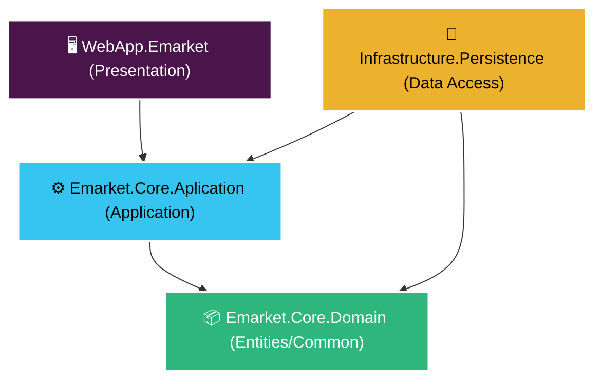

# 🛒 Emarket - Online Marketplace Platform

[](https://dotnet.microsoft.com/)
[](https://www.docker.com/)
[](https://dokploy.com/)

An elegant, Onion Architecture-based MVC web application built with **ASP.NET Core 5.0** and **Entity Framework Core**. Emarket allows users to list, categorize, and sell products in a clean, responsive marketplace layout.

---

## 🏛️ Project Architecture

Emarket is structured using **Onion Architecture** principles to enforce strict separation of concerns, high testability, and decoupling from external dependencies.



### Layer Breakdown

1. **`WebApp.Emarket` (Presentation)**: ASP.NET Core MVC project containing Controllers, Views, ViewModels, and Static Assets (`wwwroot`). It acts as the entry point of the application.
2. **`Emarket.Core.Aplication` (Application)**: Houses core business logic, validation rules, service contracts (interfaces), and service implementations. It is completely decoupled from infrastructure details.
3. **`Emarket.Infrastructure.Persistence` (Persistence)**: EF Core Database Context (`EmarketContext`), database migrations, and repository implementations interface directly with SQL Server.
4. **`Emarket.Core.Domain` (Domain)**: Houses core enterprise entities (`Adds`, `Categories`, `User`) and common base entities (`AuditableBase`) without external dependencies.

---

## 💻 Tech Stack

- **Backend Framework**: .NET 5.0 MVC
- **ORM**: Entity Framework Core 5.0
- **Database**: Microsoft SQL Server
- **Styling**: Bootstrap 5 (with custom CSS overrides)
- **Containerization**: Docker & Docker Compose
- **Deployment Platform**: Dokploy PaaS (Self-hosted alternative to Coolify/Heroku)

---

## ⚙️ Configuration & Environment Variables

The project uses environment variables to configure its runtime behavior dynamically. Copy `.env.example` to create your own local `.env` file:

```bash
cp .env.example .env
```

| Environment Variable | Description | Default Value |
| :--- | :--- | :--- |
| `MSSQL_SA_PASSWORD` | The SA password for the SQL Server container. Must meet complexity rules. | `YourSecurePassword123!` |
| `PORT` | The local port on your host machine mapping to the Web Application. | `8080` |
| `UseInMemoryDatabase` | Set to `true` to run EF Core on an in-memory db instead of SQL Server. | `false` |

---

## 🚀 Running Locally

### Option A: Using Docker Compose (Recommended)

Make sure you have [Docker Desktop](https://www.docker.com/products/docker-desktop/) installed and running.

1. Ensure you have a `.env` file containing a secure password for the database.
2. Build and launch the containers:
   ```bash
   docker-compose up --build -d
   ```
3. Docker Compose will automatically:
   - Start the MS SQL Server (`db` service).
   - Verify its health state.
   - Build and start the ASP.NET Core application (`web` service).
   - **Apply EF migrations automatically** to set up the database.
4. Open your browser and navigate to: **`http://localhost:8080`**

### Option B: Using .NET CLI

1. Open your terminal in the root directory.
2. If you want to use SQL Server, ensure a database instance is running and update `appsettings.json`'s `DefaultConnection` string.
3. Alternatively, you can use the In-Memory Database for rapid testing by updating `appsettings.json`:
   ```json
   "UseInMemoryDatabase": true
   ```
4. Run the project using the dotnet CLI:
   ```bash
   dotnet run --project Emarket/WebApp.Emarket.csproj
   ```
5. Navigate to the port listed in the console logs (usually `http://localhost:5000`).

---

## ☁️ Deploying to Dokploy

Dokploy makes it incredibly easy to host Docker-based applications. Follow this step-by-step guide to deploy Emarket:

### Step 1: Create a Project & Compose Service
1. Log into your **Dokploy** Dashboard.
2. Click on **Create Project** and give it a name (e.g., `Emarket`).
3. Inside the project, click **Create Service** and select **Compose**.

### Step 2: Configure Repository Settings
1. Connect your GitHub/GitLab account or supply the public Git URL for your repository.
2. Choose the correct branch (e.g., `main`).
3. Set the **Compose Path** to `./docker-compose.yml` (relative to your repo root).

### Step 3: Configure Environment Variables
Navigate to the **Environment** tab inside your Dokploy Compose service and add:
- `MSSQL_SA_PASSWORD`: A secure password for the SQL Server SA account.
- `PORT`: `80` (Dokploy will use its reverse proxy to forward traffic to this port).

### Step 4: Mount Persistent Storage Volumes
To prevent data loss and ensure uploaded images are preserved across container updates:
1. Under **Volumes** in Dokploy (or in the Docker Compose configuration), ensure you mount persistent directories.
2. By default, the `docker-compose.yml` creates:
   - `emarket-db-data` mapped to `/var/opt/mssql` (SQL Server tables/data).
   - `emarket-uploads` mapped to `/app/wwwroot/Image` (uploaded product pictures).
3. Dokploy handles these named volumes automatically.

### Step 5: Deploy
1. Click **Deploy**.
2. Dokploy will pull the code, build the multi-stage Docker image, spin up the database container, run the startup migrations, and launch the site.
3. Bind a domain name using Dokploy's built-in Traefik reverse proxy to expose your deployment securely with automatic SSL (HTTPS).
